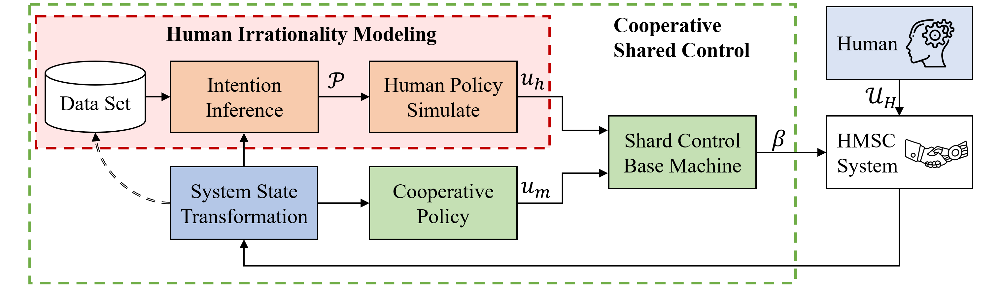

# Human-Machine Shared Stabilization Control Based on SADP With Bounded Rationality

This repository contains the code for the paper ["Human–Machine Shared Stabilization Control Based on Safe Adaptive Dynamic Programming With Bounded Rationality"](https://onlinelibrary.wiley.com/doi/abs/10.1002/rnc.7931) published in the *International Journal of Robust and Nonlinear Control* Journal (March 2025). The simulation demonstrates the basic idea of human-machine shared control based on safe ADP with Level-$k$ bounded rationality.

+ Details of the paper can be found at: [Junkai Tan's Publications](https://tanjunkai2001.github.io/publications/)
+ Download the paper at: [Download pdf](https://tanjunkai2001.github.io/assets/Human%E2%80%93Machine%20Shared%20Stabilization%20Control%20Based%20on%20Safe%20Adaptive%20Dynamic%20Programming%20With%20Bounded%20Rationality.pdf)

## Citation

If you use this code or find our research helpful, please cite our paper:

```bibtex
@article{Tan2025,
    author = {Tan, Junkai and Wang, Jie and Xue, Shuangsi and Cao, Hui and Li, Haojun and Guo, Zhongxin},
    title = {Human–Machine Shared Stabilization Control Based on Safe Adaptive Dynamic Programming With Bounded Rationality},
    journal = {International Journal of Robust and Nonlinear Control},
    year = {2025},
    month = {March},
    doi = {10.1002/rnc.7931},
    url = {https://doi.org/10.1002/rnc.7931}
}
```

## Overview

This article addresses shared control between bounded rational humans and cooperative autonomous machines. The key focus is ensuring safety in human-machine interactions through:

1. A barrier-function-based state transformation that enforces full state safety constraints
2. A level-k thinking framework to model bounded rationality 
3. Adaptive dynamic programming to approximate each level-k control policy
4. A Softmax-based probabilistic distribution to model human behavior and its inherent uncertainty

The shared control framework combines human and machine inputs to achieve safe, efficient stabilization. Simulation results demonstrate that:
- Full-state asymmetric constraints and stabilization are maintained in safety-critical situations
- System safety is preserved even when one participant lacks safety awareness



Files:
- `Simulation/main.m`: Main file to run the simulation
- `Simulation/plot_fig.m`: Main file to plot the results
- `Simulation/plot_bar.m`: Plot the distribution of rationality level